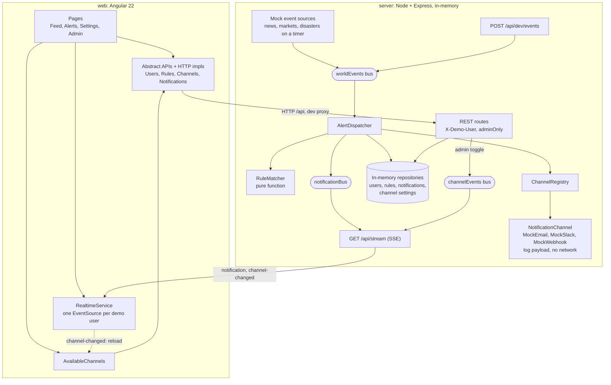

# World Alerts

A proof of concept built from this product brief:

> We want users to be able to set up alerts so they get notified when something important happens in the world — like breaking news, market movements, natural disasters, that kind of thing. Should work for both email and Slack. Make it flexible enough that we can add more channels later. We need an admin view too.

Users create alerts, see matching notifications arrive live in their feed, and choose where they are delivered. An admin turns delivery channels on and off. **Everything external is mocked**: world events come from fixture-driven feeds, and the Email, Slack and Webhook channels build the payload a real provider would receive, log it, and make no network call.

The design, constraints and acceptance criteria are in [CLAUDE.md](CLAUDE.md), along with the open questions for product.

## Quick start

Requires Node 22.22+, 24.15+ or 26+, and npm. No other services.

```bash
npm install
```

```bash
npm run dev
```

Open http://localhost:4200. The API runs on http://localhost:3000; in dev the Angular server proxies `/api` (REST and SSE) to it, so there is no CORS setup.

### A one-minute tour

1. You start as **Alice** on the **Feed**. Within about 15 seconds the mock feeds emit an earthquake that matches her "Serious disasters" alert, and it appears by Email and Slack without a refresh.
2. **Alerts**: create an alert. Category and at least one channel are required; markets alerts can also filter on a symbol and a minimum % move.
3. **Settings**: where each channel delivers. Switch to **Bob** with "Acting as": he has no Slack handle, so his Slack deliveries are recorded as skipped until he adds one.
4. Switch to **Admin** and open **Admin**: turn Slack off. It disappears from everyone's channel picker at once, and deliveries through it are recorded as skipped (channel disabled). Turn it back on to restore them.

Fire an event yourself instead of waiting for the feeds:

```bash
curl -X POST localhost:3000/api/dev/events -H 'content-type: application/json' -d '{"category":"disasters","title":"Big quake","severity":5,"tags":["earthquake"]}'
```

Required: `category` (`news`, `markets` or `disasters`), `title`, `severity` (1-5). Optional: `summary`, `tags`, `symbol`, `percentChange`, `id`, `occurredAt`, `source`.

### Demo data

Seeded on every start; the server keeps everything in memory, so a restart resets it.

| User | Role | Destinations | Alerts |
|---|---|---|---|
| Alice (`u-alice`) | user | email, Slack | Serious disasters (severity 4+, Email and Slack); Big ACME moves (ACME, 3%+, Slack) |
| Bob (`u-bob`) | user | email only | Election news (keyword "election", severity 3+, Email and Slack) |
| Carol (`u-carol`) | user | none | none |
| Admin (`u-admin`) | admin | email, Slack | none |

### Commands

| Command | What it does |
|---|---|
| `npm run dev` | Server (`tsx watch`) and web (`ng serve`) together |
| `npm test` | Vitest in both workspaces |
| `npm run build` | `tsc` for the server, `ng build` for the web app |
| `npm test -w server` / `npm test -w web` | One workspace |

| Environment variable | Default | Effect |
|---|---|---|
| `API_PORT` | `3000` | API port; the web dev proxy reads it too. (Not `PORT`: `ng serve` also reads that.) |
| `EVENT_INTERVAL_MS` | `15000` | How often each mock feed emits |
| `NODE_ENV=production` | | Removes `POST /api/dev/events` |

## Architecture



The server is layered **ports → adapters → services → http**. Ports (`server/src/ports`) are the interfaces a real integration would implement: `EventSource`, `NotificationChannel` and the repositories. Adapters are the mocks and in-memory stores behind them. Services never name a concrete channel or feed.

What happens to one event:

1. An `EventSource` (or `POST /api/dev/events`) publishes a `WorldEvent` on the `worldEvents` bus.
2. `AlertDispatcher` asks `RuleMatcher` which enabled rules match: category, severity at or above the rule's minimum, any keyword (case-insensitive, in title, summary or tags), and for markets the symbol and minimum absolute % move.
3. For each matching rule and each of its channels, it looks the channel up in `ChannelRegistry` and records exactly one notification:
   - `skipped` if the channel is unregistered, disabled by the admin, or the user has no valid destination for it;
   - `sent` if `send()` succeeds;
   - `failed` if `send()` throws or reports an error. Channels are independent: one failing never blocks the others.
4. Each notification is stored and published on `notificationBus`. The SSE stream forwards it only to its owner, whose Feed shows it immediately.
5. When the admin toggles a channel, `channelEvents` tells every connected browser; `AvailableChannels` reloads, so channel pickers and Settings update without a refresh.

The web app injects abstract API classes (`UsersApi`, `RulesApi`, `ChannelsApi`, `NotificationsApi`); `provideHttpApi()` binds them to HTTP implementations, and tests bind fakes. No component or template names a channel: the picker, Settings and the admin table all render from the API.

## How to add a channel

1. Create a class that implements `NotificationChannel` (`server/src/ports/index.ts`):
   - `id`, `displayName`, and `destinationKind` (what the user must provide, e.g. "HTTPS webhook URL");
   - `validateDestination(destination)`: accept or reject a user's destination, with a reason;
   - `send(message)`: deliver, and return `{ ok: true, payload }` or `{ ok: false, error }`. Throwing is also handled.
2. Register it in `server/src/channels.ts`:

   ```ts
   registry.register(new MyChannel());
   ```

That is all. The channel then appears in the admin list, in every user's channel picker and on the Settings page, its destinations are validated with its own rules, and it receives deliveries.

Commit `318c851` does exactly this for `MockWebhookChannel`: two new files (the channel and its test) and two lines in `channels.ts`.

To use a **real provider**, implement the same interface with a real client (an SMTP library, the Slack Web API, `fetch` to a webhook) and register it in place of the mock. The same goes for a real news or market feed: implement `EventSource` and pass it to `createContainer()` (see `server/src/index.ts`). Nothing in the services, routes or web app changes.

## API

There is no real auth. Name a seeded user in the `X-Demo-User` header. The SSE stream also accepts `?userId=`, because `EventSource` cannot set headers. A missing or unknown user gets 401. Errors are `{ "errors": [...] }` for 400 validation failures and `{ "error": "..." }` otherwise.

| Route | Who | Notes |
|---|---|---|
| `GET /api/health` | public | |
| `GET /api/demo-users` | public | `id`, `name`, `role` for the user switcher |
| `GET /api/channels` | public | Enabled channels only: `id`, `displayName`, `destinationKind` |
| `POST /api/dev/events` | public, dev only | See Quick start |
| `GET /api/stream` | user | SSE. `notification` (own only), `channel-changed` (`{ channelId, enabled }`, to everyone) |
| `GET /api/me` | user | The user, with `contacts` |
| `GET /api/me/contacts` | user | `{ [channelId]: destination }` |
| `PUT /api/me/contacts` | user | Merges: channels not in the body are kept; `""` or `null` clears one. Each destination is validated by its channel |
| `GET /api/rules`, `GET /api/rules/:id` | user | Own rules only |
| `POST /api/rules` | user | Requires `category` and a non-empty `channelIds`. Optional: `name`, `keywords`, `minSeverity` (default 1), `enabled` (default true). Markets only: `symbol`, `minPercentMove` (dropped for other categories) |
| `PUT /api/rules/:id` | user | Full replacement, same body as POST; `id` and `userId` are never taken from the body |
| `DELETE /api/rules/:id` | user | 204 |
| `GET /api/notifications` | user | Own history, newest first. Each carries `ruleName`, `channelName` and an event summary copied at delivery time, so history still reads correctly after a rule is deleted or a channel disabled |
| `GET /api/admin/channels` | admin | Every registered channel with `enabled` |
| `PATCH /api/admin/channels/:id` | admin | `{ "enabled": boolean }`; also pushes `channel-changed` over SSE |

Another user's rule answers 404, the same as a missing one, so ids don't leak. Non-admins get 403 on every `/api/admin/*` route.

## Web app (`web/src/app`)

- `core/api/`: the abstract API classes, their `Http*` implementations and `provideHttpApi()`.
- `core/session.service.ts`: the current demo user, kept in localStorage; `core/demo-user.interceptor.ts` sends it as `X-Demo-User`.
- `core/realtime.service.ts`: one SSE connection per demo user, exposed as signals (`status`, `notifications`, `lastChannelChange`).
- `core/available-channels.ts`: the enabled channels, reloaded on each `channel-changed` while the current list stays on screen.
- `core/admin.guard.ts`: `canMatch` guard for `/admin/*`; others go to the feed.
- `pages/`: one lazy-loaded page per route (`/feed` is home; `/alerts`, `/settings`, `/admin/channels`). Data comes from `rxResource`s keyed on the demo user, so switching user reloads each page.
- `ui/`: pieces shared across pages: status tag, toasts, loading/empty/error states.
- `src/styles.css`: Tailwind, the design tokens, and the shared control styles (`btn`, `input-field`, `switch`).

No component library: native elements (`<dialog>`, `<table>`, checkbox switches) styled with Tailwind. Every page has loading, empty and error states and works at 375px width.

## Tests

`npm test` runs 168 server tests and 104 web tests, all with Vitest and none needing a network or a running server.

- **Server**: the matcher, dispatcher (failure isolation, skipped deliveries, disabled channels), registry, event bus and mock channels; every route over real HTTP, including role checks and ownership; the SSE stream over a real connection; and a full delivery through every registered channel with `fetch`, `http`, `https` and `net` stubbed to throw.
- **Web**: components through `TestBed` with fakes for every abstract API and a fake `EventSource` (`src/app/testing`). This includes the four UI tests `CLAUDE.md` requires: alert form validation, `adminGuard`, the channel picker following the API and a disabled channel, and the feed appending SSE messages.

## Acceptance criteria

Walked on 2026-09-29. "Browser" means checked by hand against the running app.

| AC | Evidence |
|---|---|
| AC1 create alert, validation | `alert-form.spec.ts` (blocks no category / no channel), `rule-input.test.ts`, `rules.test.ts`; browser |
| AC2 edit, enable/disable, delete own; others' blocked | `rules.test.ts` (others' rules answer 404 and stay unchanged), `alerts-page.spec.ts` |
| AC3 markets symbol and % move | `rule-matcher.test.ts`, `rules.test.ts` (2% ignored, 5% fires), `alert-form.spec.ts`; browser |
| AC4 match creates one per channel, non-match none | `rule-matcher.test.ts`, `alert-dispatcher.test.ts`, `app.test.ts` |
| AC5 disabled rules never fire | `alert-dispatcher.test.ts`, `rules.test.ts` (paused through the API) |
| AC6 no channel named in dispatcher or UI | Dispatcher only uses `ChannelRegistry`; no `'email'`, `'slack'` or `'webhook'` literal in `server/src/services`, `server/src/http` or non-test `web/src/app` code |
| AC7 no network calls | `container.test.ts` (every channel, network stubbed to throw), `mock-webhook-channel.test.ts`. A run with the machine disconnected was not done |
| AC8 a throwing channel doesn't block others | `alert-dispatcher.test.ts` |
| AC9 missing destination is skipped with a reason | `alert-dispatcher.test.ts`, `me.test.ts`; Settings warns about empty destinations |
| AC10 new channel = class + `register()` | Commit `318c851`; `admin.test.ts`, `app.test.ts`, and the web picker, Settings and admin specs render an extra channel; browser |
| AC11 live, own notifications only | `stream.test.ts`, `realtime.service.spec.ts`, `feed-page.spec.ts`; browser (arrived in under 1.5 s) |
| AC12 Admin nav item, `/admin` guarded in UI and API | `app.spec.ts`, `admin.guard.spec.ts`, `admin.test.ts` (403) |
| AC13 admin enable/disable, picker and skipped deliveries follow | `admin.test.ts` (end to end), `admin-channels-page.spec.ts`, `alerts-page.spec.ts`, `settings-page.spec.ts`; browser |
| AC14 `npm test` green | 168 server + 104 web |
| AC15 clean checkout runs, builds | Fresh clone of this branch: `npm install`, `npm run build`, `npm test` pass; `npm run dev` served the app 7 s after start |
| AC16 full flow within a minute | Same fresh clone: Alice's first notification was delivered 12 s after `npm run dev` |
| AC17 native elements + Tailwind, 375px, page states | No component-level styles; each page checked at 375px in the browser; loading, empty and error states tested per page |

## Versions

Checked together at scaffold time (2026-09-29):

- Shared: Node 26.8, npm 11.19, Vitest 5.0.
- Server: TypeScript 7.0, Express 5.2, tsx 4.23.
- Web: Angular 22.2 (zoneless; Vitest through `@angular/build:unit-test` with jsdom 30.1), TypeScript 6.0 (Angular 22 requires `>=6.0 <6.1`, so `web` has its own copy), Tailwind CSS 4.3 via `@tailwindcss/postcss`.
- No component library. PrimeNG was the original choice; from v22 it requires a licence key under a commercial/community licence (21.x was MIT), so the UI uses native elements and Tailwind.

## Limitations

- In-memory only: a restart resets users, alerts and history.
- Demo identity, not authentication: anyone can send any `X-Demo-User`.
- One notification per event, rule and channel: no deduplication, throttling or digests.
- `package-lock.json` is git-ignored (from the original `.gitignore`), so a fresh install resolves the newest versions allowed by each `package.json` range.
- On Windows, `ng serve` once exited at start-up with code 3221225477 (an access violation). Running `npm run dev` again worked. npm 11 skips install scripts it has not been told to trust (`npm install-scripts ls` lists them); approving them may prevent this.

See [CLAUDE.md](CLAUDE.md) for the product questions these choices depend on.
